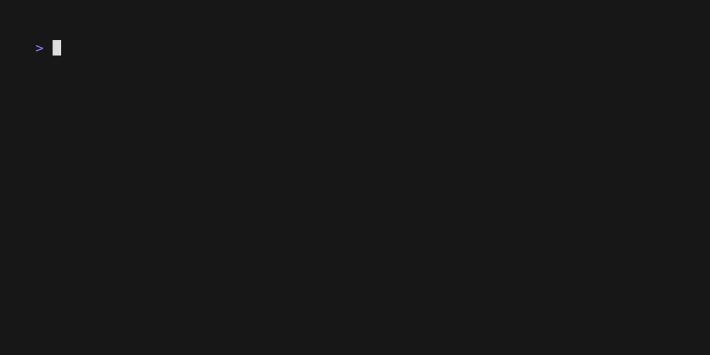

XMLLab
======

<!-- To publish to PowerShell Gallery, commit an update to the .psd1 file -->

Cmdlets to query, transform, and update XML data.

- [Compare-Xml](https://github.com/brianary/XMLLab/wiki/Compare-Xml): Compares two XML documents and returns the differences.
- [Convert-Xml](https://github.com/brianary/XMLLab/wiki/Convert-Xml): Transform XML using an XSLT template.
- [ConvertFrom-EscapedXml](https://github.com/brianary/XMLLab/wiki/ConvertFrom-EscapedXml): Parse escaped XML into XML and serialize it.
- [ConvertFrom-XmlElement](https://github.com/brianary/XMLLab/wiki/ConvertFrom-XmlElement): Converts named nodes of an element to properties of a PSObject, recursively.
- [ConvertTo-XmlElements](https://github.com/brianary/XMLLab/wiki/ConvertTo-XmlElements): Serializes complex content into XML elements.
- [Format-Xml](https://github.com/brianary/XMLLab/wiki/Format-Xml): Pretty-print XML.
- [Get-XmlNamespaces](https://github.com/brianary/XMLLab/wiki/Get-XmlNamespaces): Gets the namespaces from a document as a dictionary.
- [Merge-XmlSelections](https://github.com/brianary/XMLLab/wiki/Merge-XmlSelections): Builds an object using the named XPath selections as properties.
- [New-NamespaceManager](https://github.com/brianary/XMLLab/wiki/New-NamespaceManager): Creates an object to lookup XML namespace prefixes.
- [Resolve-XmlSchemaLocation](https://github.com/brianary/XMLLab/wiki/Resolve-XmlSchemaLocation): Gets the namespaces and their URIs and URLs from a document.
- [Resolve-XPath](./src/public/Resolve-XPath.ps1): <!-- ERROR: Unable to find type [Xml.XmlNode]. -->
- [Test-Xml](https://github.com/brianary/XMLLab/wiki/Test-Xml): Try parsing text as XML, and validating it if a schema is provided.
